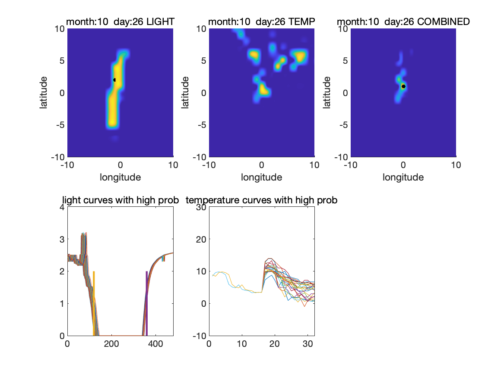
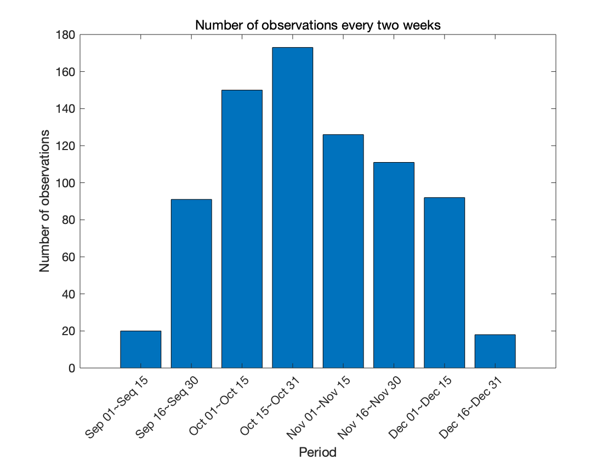
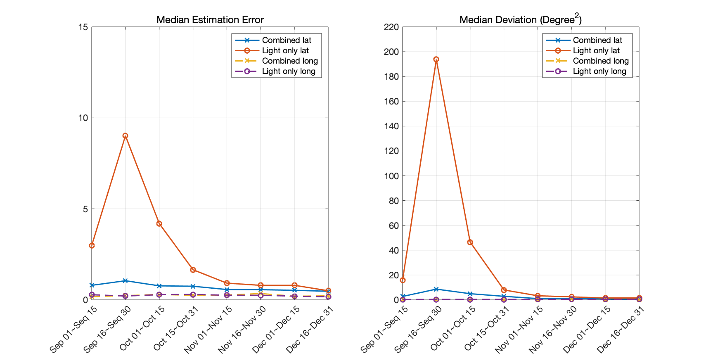

# Migrating Monarch Butterfly Localization UsingMulti-Modal Sensor Fusion Neural Networks

## Generate training data

The training data for temeprature is included as `./dataset/Temp_train_16.mat` and  `./dataset/Temp_valid_16.mat`

To generate the training data for light, you need to run the MATLAB script `Generate_trainset_light.m`. Then, you are expected to get `./dataset/Light_train_8.mat` and `./dataset/Light_valid_8.mat`.

***Update***: for the privacy consideration, we ***removed the raw data from this repository***. Instead, we share the processeed training set following this [link](https://drive.google.com/drive/folders/1FTjgdVCJsvRUyMJ-R5ODXGB6jr0jhJkB?usp=sharing)

## Train the neural networks

Simply run `train_light.py` and `train_temp.py`. The logs will be stored in `./logs` and the trained models will be stored in `./model`

## Testing the neural networks

The test data for temperature and light are included in `./testdata/Test_set_temp` and `./testdata/Test_set_light`. The light and temperature curves are sampled around the rounded ground truth (for the seek of privacy). We provide 20 test examples.

The pretrained models are included in `./model` and you can directly run this part without re-training the neural networks

### Generate heatmaps

Run `test_light.py` and `test_temp.py`, and the heatmaps (confidence) will be stored in `./results`

### Visualization

Run `visualization.m`. The visualization of heatmaps are stored in `./results/heatmap_visual`. 

Here is an example of visualization plot

Here are the MLE localization results over all test data

## Reference 
> Mingyu Yang, Roger Hsiao, Gordy Carichner, Katherine Ernst, Jaechan Lim, Delbert A. Green II, Inhee Lee, David Blaauw, and Hun-Seok Kim, "Migrating Monarch Butterfly Localization UsingMulti-Modal Sensor Fusion Neural Networks", EUSIPCO 2020
